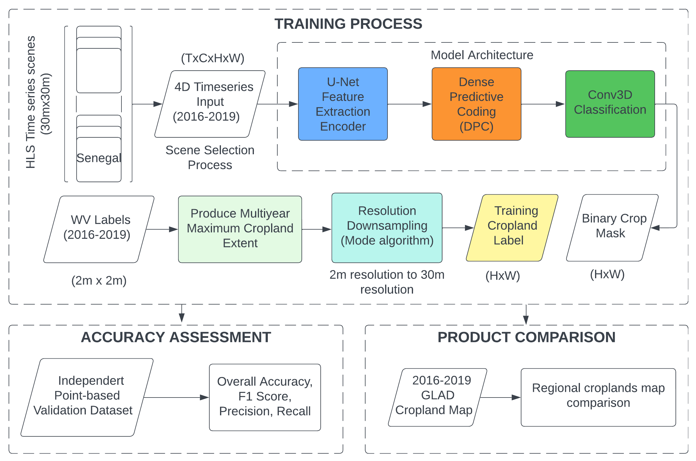
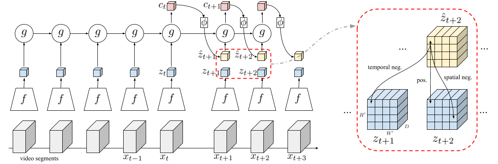

# RQUNet-DPC
 
Dense Predictive Coding [model](https://github.com/TengdaHan/DPC) and UNet [model](https://github.com/jaxony/unet-pytorch) architecture framework for segmenting satellite images time series.<br>

## Proposed Architecture and Workflow
 <br>

## Dense Predictive Coding Architecture
 <br>

## HLS time series data
 <br>

## How to run the code
Create the Python environment 3.8.12 in terminal/command line for Linux OS <br>
```conda env create -f environment.yml``` <br>
```conda activate env``` <br>

### Sample images into timeseries dataset
To preprocess images to hdf5 datacube <br>
```python preprocess/create_full_hls_datacube.py``` <br>


### Training DPC and other DL models

To train DPC+UNet model for image segmentation, prepare the Dataset in time series format for Pytorch: T x C x H x W <br>
```python models/train_dpc_seg_nonoverlap.py --net unet --dataset Tappan01 --img_dim 64 --epochs 100 --lr 1e-3``` <br>
To train UNet mean-frame segmentation model <br>
```python models/train_unet_meanframe.py``` <br>
To train benchmark model, ConvLSTM or ConvGRU <br>
```python models/train_benchmodel.py --model convlstm --dataset Tappan01 --img_dim 64 --epochs 100```

To perform prediction for small tiles of large raster, same dataset format <br>
```python models/predict_nonoverlap.py```

To perform window sliding prediction, run the file <br>
```python RQUNet-DPC/models/predict_nonoverlap.py --img_dim 64 --model dpc-unet --segment_model conv3d --ts_length 16 --dataset PEV_large_2019 --net unet --channels 10 --standardization None --rescale None --addindices False``` <br>
```python RQUNet-DPC/models/predict_nonoverlap.py --img_dim 64 --model 3d-unet --ts_length 16 --dataset PFB_large_2019 --net unet --channels 10 --standardization None --rescale None --saveproba False``` <br>

To run experiment DPC+Poisson segmentation <br>
```python dpc_poisson.py``` <br>


## Results
 <br>


