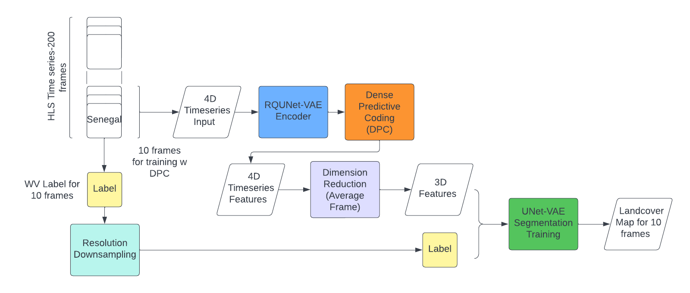

# RQUNet-DPC
 
Dense Predictive Coding [model](https://github.com/TengdaHan/DPC) and UNet [model](https://github.com/jaxony/unet-pytorch) architecture framework for segmenting satellite images time series.<br>

## Proposed Architecture and Workflow
 <br>

## Dense Predictive Coding Architecture
 <br>

## How to run the code
Create the Python environment 3.8.12 in terminal/command line for Linux OS <br>
```conda env create -f environment.yml``` <br>
```conda activate env``` <br>

To train DPC+UNet model for image segmentation, prepare the Dataset in time series format for Pytorch: T x C x H x W <br>
```python models/train_dpc_seg.py --net unet --dataset Tappan01 --img_dim 64 --epochs 100 --lr 1e-3``` <br>
To train UNet mean-frame segmentation model <br>
```python models/train_unet_meanframe.py``` <br>
To train benchmark model, ConvLSTM or ConvGRU <br>
```python models/train_benchmodel.py --model convlstm --dataset Tappan01 --img_dim 64 --epochs 100```

To perform prediction for small tiles of large raster, same dataset format <br>
```python models/predict_dpc_seg.py```

To perform window sliding prediction, run the file <br>
```python models/predict_sliding.py --gpu 0 --model convlstm --dataset PEV_2021``` <br>
```python models/predict_sliding.py --gpu 0 --net unet --model dpc-unet --dataset Tappan13``` <br>

To run experiment DPC+Poisson segmentation <br>
```python dpc_poisson.py```


